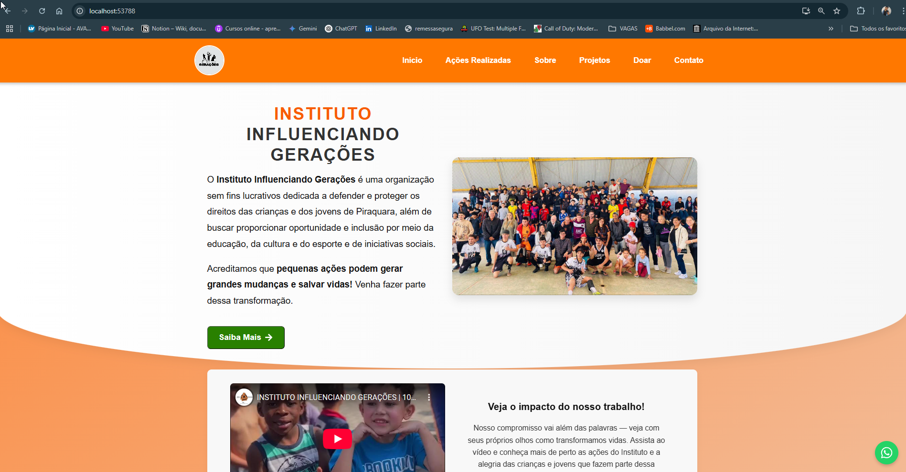

# Instituto Influenciando Gerações 🌱

Este site foi desenvolvido para o **Instituto Influenciando Gerações**, uma organização sem fins lucrativos dedicada a **defender e proteger os direitos das crianças e dos jovens de Piraquara**. A ONG promove **oportunidade e inclusão por meio da educação, cultura, esporte** e diversas **iniciativas sociais**.

> Acreditamos que **pequenas ações podem gerar grandes mudanças e salvar vidas!**  
> Venha fazer parte dessa transformação.

---

## 🚀 Tecnologias Utilizadas

- React.js (Create React App)
- HTML5 + CSS3
- JavaScript ES6+
- API REST

---

## 📦 Scripts Disponíveis

No diretório do projeto, você pode executar:

### `npm start`

Executa o app em modo de desenvolvimento.\
Abra [http://localhost:3000](http://localhost:3000) para ver no navegador.

### `npm test`

Inicia o test runner no modo interativo.

### `npm run build`

Cria o build da aplicação para produção.

### `npm run eject`

⚠️ Copia as configurações internas do CRA para o projeto.

---

## 📚 Saiba Mais

- [Documentação do Create React App](https://facebook.github.io/create-react-app/docs/getting-started)
- [Documentação do React](https://reactjs.org/)

---

## 💙 Contribuindo

Se você deseja contribuir com esse projeto e apoiar essa causa, entre em contato ou faça um pull request!

---

## ✨ Contato

- 📧 contato@institutoinfluenciandogeracoes.org
- 🌐 [Site oficial](https://institutoinfluenciandogeracoes.org) (exemplo)

---

